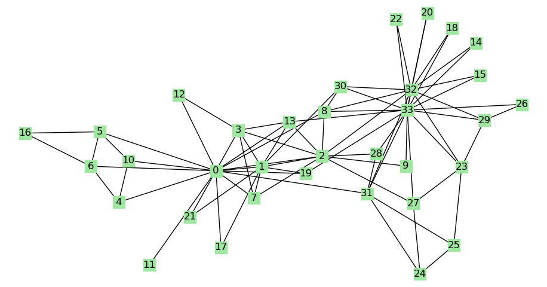
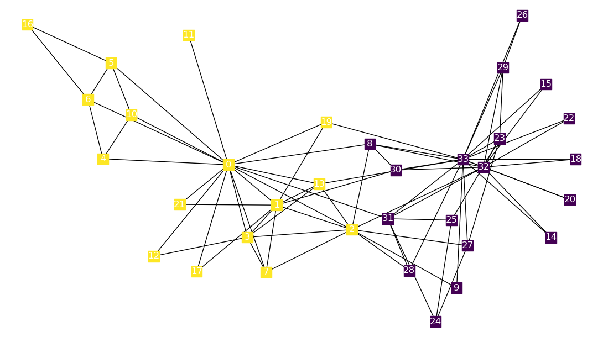

#### :derelict_house:社区发现算法

#### 1. 投票制启发的社区发现算法

> 非这方面的研究者，课程作业而已，轻喷:joy:

##### 1.1 灵感来源:artificial_satellite:

来源于日常生活中的投票选举制度，即可将选举中每个个体的投票可以看成是在社区中的选择。通过这种在多名候选者其中选一的方法，可以确定个体对于每个以候选者为中心的社区中的倾向度，由此来划分为不同的社区。

以美国总统选举为例，每名选举人需要从总统候选人选其一（不考虑弃权）。那么所有投同一候选人的选民即可以从某种程度上看成是同一社区（例如川普支持者或者希拉里支持者），因为他们拥有类似的政治倾向。

##### 1.1 算法步骤:steam_locomotive:

类似于真正的投票选举，该算法主要分为两大步骤，**候选人选择**与**选民投票**。

首先，对于一个群体G，首先需要选举出每个社区的候选人。对于指定n个社区，我们需要选择出n个候选者$S=\{s_1,s_2,...s_n\}$。在本步骤中，需要根据\textbf{候选依据}从所有的节点中选择出n个最具有代表性的候选者。这n个候选者$S=\{s_1,s_2,...s_n\}$就分别对应了n个社区$C=\{c_1,c_2,...,c_n\}$。同时，在此步骤中，需要考虑到选择出的候选者可能是同一社区的，所以候选算法需要有一定的办法去识别到这种情况并处理。

之后，对于选民$P=G-S=\{p_1,p_2,...p_m\}$,即群体中的非候选人。每个选民，需要依次从n个候选人中根据**投票策略**来选择其中一个候选者。当选民v选择了候选者$s_i$，就代表该选民属于社区$c_i$，即$v\in c_i$。其中投票策略可以是根据与候选者的距离，当距离一致时候跟从自己的邻居选择的最多数。

##### 1.2 算法图解:rainbow:

###### 1.2.1 原始数据

###### 1.3.2 候选人选择

根据入度，选择了33和0作为两位候选者。

###### 1.3.3 投票站队

其余的点每个人进行投票选择站队。

#### 2. 性能对比

| 数据集                     | Louvain算法 | GN算法  | 层次聚类 | 谱聚类  | Bron-Kerbosch | 基于选举制的启发式算法 |
| -------------------------- | ----------- | ------- | -------- | ------- | ------------- | ---------------------- |
| Karate空手道俱乐部         | 0.21079     | 0.20488 | 0.01438  | 0.02490 | 0.35042       | 0.21000                |
| Football美国大学生足球联赛 | 0.29368     | 0.30300 | 0.28522  | 0.29117 | 0.45296       | 0.18615                |
| Dolphin 新西兰海豚         | 0.17062     | 0.20005 | 0.00971  | 0.10699 | 0.42768       | 0.15353                |
| Lesmis 悲惨世界            | 0.25663     | 0.14489 | 0.00198  | 0.14845 | 0.36803       | 0.22108                |
| 平均值                     | 0.23293     | 0.21321 | 0.07782  | 0.14288 | 0.39977       | 0.19269                |

#### 3. 目录结构:baby_chick:

- Dataset：常见的社区发现数据集
- imgs: 图片
- logs: 自己设计算法的日志
- result: 对比结果
- mian.py: 主程序
- vote_algorithms.py: 自己设计的算法